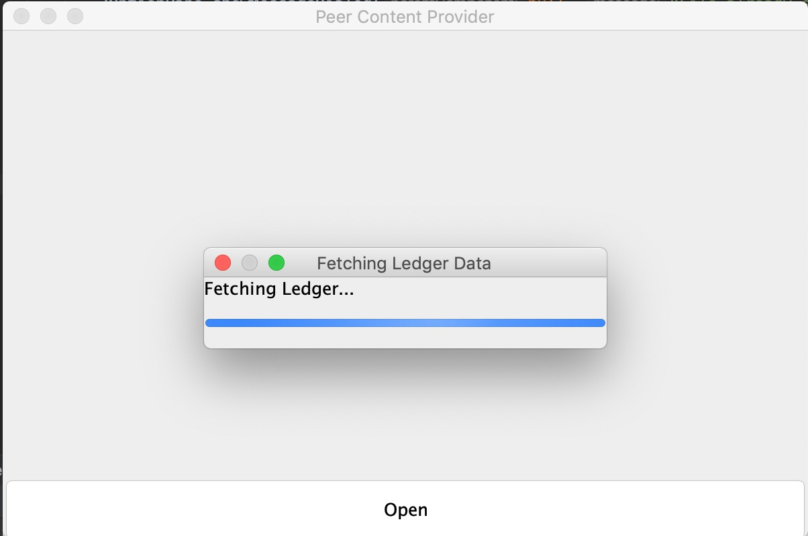
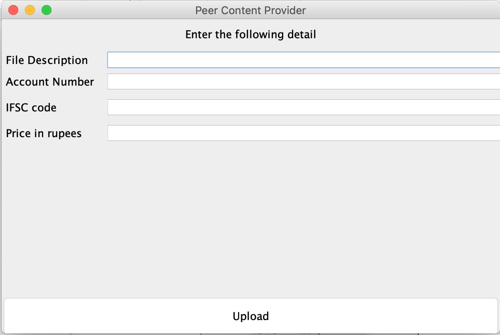
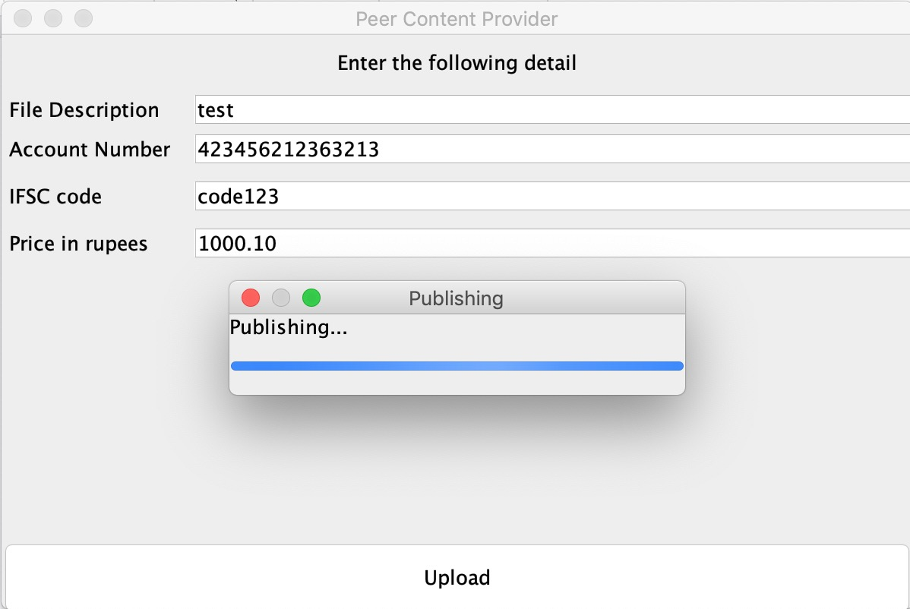
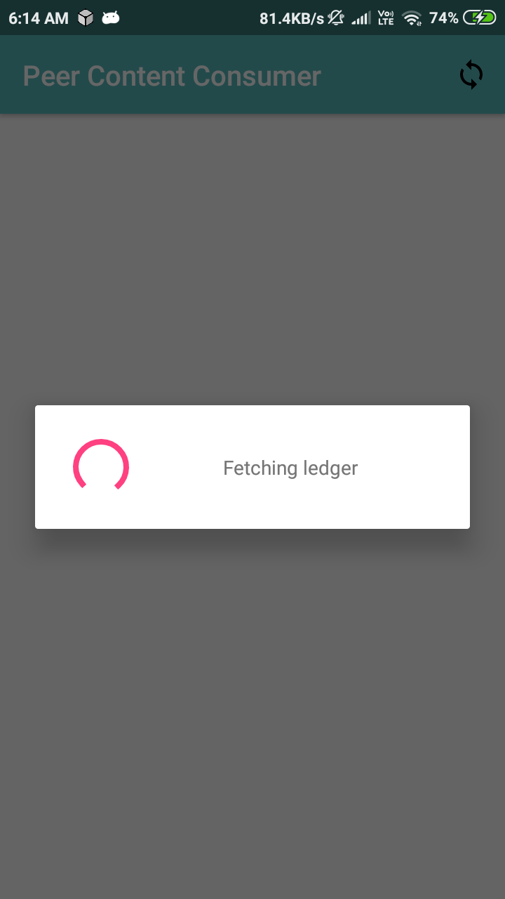
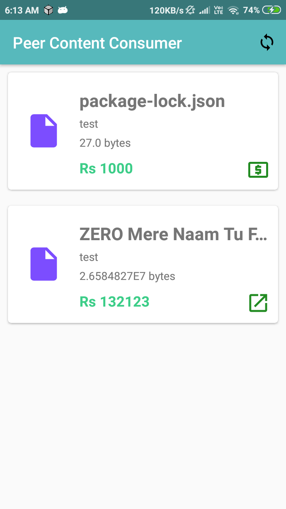
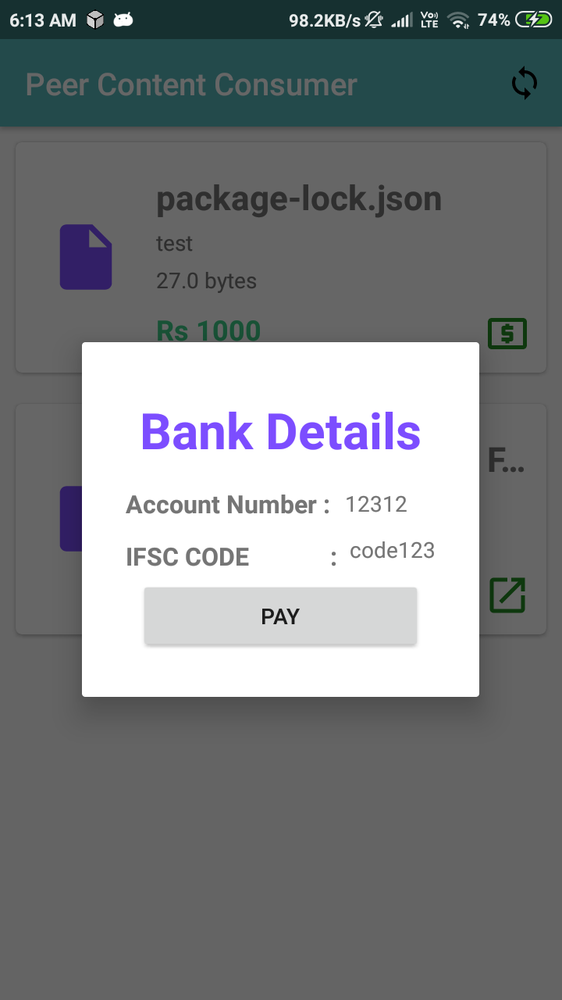

# About the project

This project is a POC project that aims to eliminate piracy in distributed peer to peer file sharing technology using a public ledger model. 

**note:** this project is enirely under development and i am trying out new things. The current methodolog is not scalable.

# Components

This project contains two applications they are as follows,

1. Peer Content Provider
1. Peer Content Consumer

## Peer Content Provider

This a project writtern in kotlin and swing framework. To run the application follow the steps:

    1. Install ipfs cli and run ipfs daemon
    1. Run the project with any ide using gradle

This application acts as content upload platform. Its duty is to encrypt the file and upload it to ipfs. The following are the screenshots,

## Peer Content Consumer

**Note:** This project is extended from open source project by ligi named IPFSDroid.

This android app acts as a consumer of the contents that are uploaded. It reads the ledger and gets file meta data and displays to the user. The user downloads the file and for decryption he must pay the demanded amount. Every previewer of the app will be self writtern in a way that the file remains encrypted while stored on device. Also secure layout is added to avoid screen recording or capture. Future scope of the app will be to detect emulators and rooted devices and block them from using the app.

The following are the steps to run the project,

    1. Just open in android studio and click the play button!

The following are the screenshots,

# License
This project is licensed under GPL-3.0
